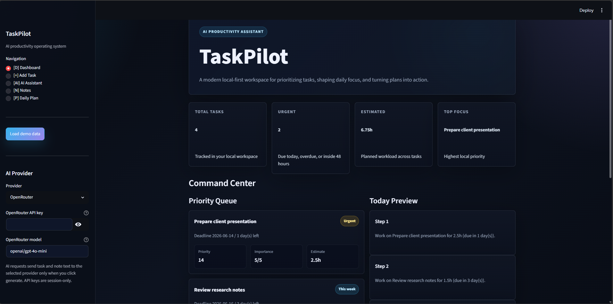
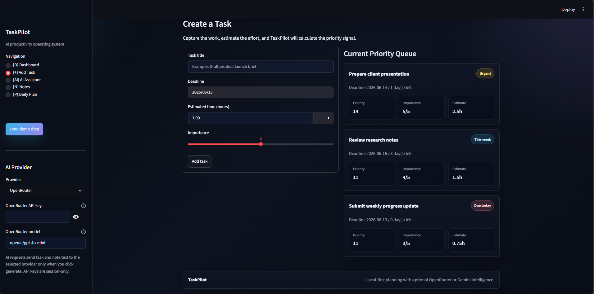
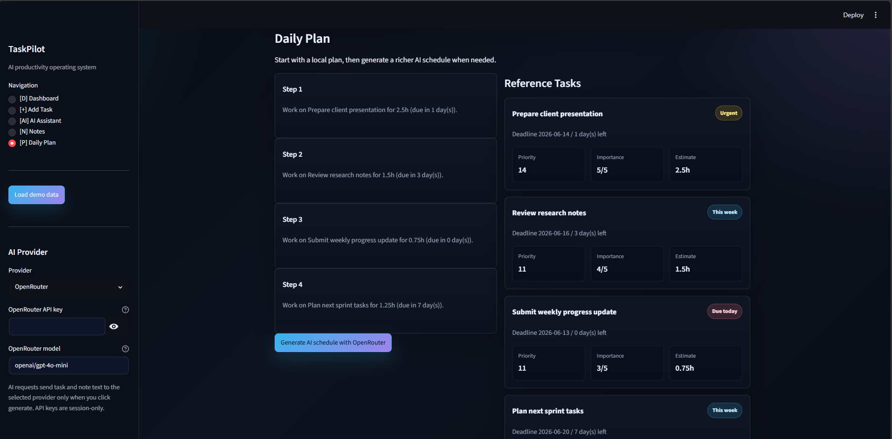

# TaskPilot

TaskPilot is a modern AI-powered productivity assistant prototype for students and professionals. It helps users capture tasks, understand urgency, generate daily plans, and get productivity recommendations from OpenRouter or Google Gemini while keeping task data local.

The app is built as a portfolio-ready Streamlit product prototype with a dark SaaS-style interface, local JSON storage, demo data, dashboard metrics, task cards, notes, and optional AI planning.

## Project Overview

TaskPilot combines local productivity logic with optional AI assistance:

- Local planning calculates priority scores from task importance and deadline urgency.
- The dashboard summarizes total tasks, urgent tasks, estimated workload, and top focus.
- The daily plan works without an API key.
- AI recommendations become available when the user selects OpenRouter or Google Gemini and enters a session-only API key.

All saved tasks and notes live in `taskpilot_data.json`. API keys are never saved to JSON or repository files.

## Problem Statement

Students and professionals often manage work across scattered notes, calendars, reminders, and task lists. This makes it harder to decide what matters most, estimate the day realistically, and stay focused.

TaskPilot solves this by bringing tasks, notes, prioritization, scheduling, and AI-powered productivity guidance into one simple local-first workspace.

## Features

- Modern dark SaaS-style UI
- Sidebar navigation with focused workspace sections
- Add tasks with title, deadline, estimated time, and importance
- Local priority scoring based on deadline urgency and importance
- Dashboard metrics for total tasks, urgent tasks, estimated hours, and top focus
- Task cards and formatted table views
- Local daily plan generation without AI
- Notes workspace for quick reminders and context
- Demo data button for instant product preview
- Optional AI assistant for prioritization, scheduling, and productivity suggestions
- Support for OpenRouter and Google Gemini
- Session-only API key entry
- Local JSON storage with no database required
- Windows launcher with `run_app.bat`

## Technologies Used

- Python
- Streamlit
- Requests
- JSON file storage
- OpenRouter API
- Google Gemini API
- HTML/CSS inside Streamlit for custom UI styling

## Installation Guide

1. Clone or download this repository.

2. Open a terminal in the project folder.

3. Create a virtual environment:

```bash
python -m venv .venv
```

4. Activate the virtual environment on Windows:

```bash
.venv\Scripts\activate
```

5. Install dependencies:

```bash
pip install -r requirements.txt
```

6. Run the app:

```bash
streamlit run app.py
```

On Windows, you can also run:

```bash
run_app.bat
```

## AI Providers Supported

TaskPilot works without an API key for non-AI features. AI features require choosing a provider in the sidebar and entering a provider-specific API key.

### OpenRouter

1. Create or sign in to an OpenRouter account at `https://openrouter.ai/`.
2. Create an API key.
3. In TaskPilot, select `OpenRouter` in the sidebar.
4. Paste your OpenRouter API key.
5. Use the default model or enter another OpenRouter chat model slug.

Default model:

```text
openai/gpt-4o-mini
```

### Google Gemini

1. Create or sign in to Google AI Studio at `https://aistudio.google.com/`.
2. Create a Gemini API key.
3. In TaskPilot, select `Google Gemini` in the sidebar.
4. Paste your Gemini API key.
5. Use the default model or enter another Gemini model name.

Default model:

```text
gemini-3.5-flash
```

### API Key Privacy

API keys are entered through Streamlit sidebar fields and only live in the current session. TaskPilot does not save API keys to `taskpilot_data.json`, `.env`, or any other repository file.

## Screenshots

### Dashboard

The dashboard gives an immediate overview of task volume, urgent work, estimated workload, and the highest-priority focus item.



### Task Management

The task workspace lets users add structured tasks and review the priority queue in a polished card-based layout.



### Daily Plan

The daily plan view turns saved tasks into a focused schedule and keeps the reference task list close by.



## Project Structure

```text
taskpilot/
|-- app.py                 # Main Streamlit application
|-- README.md              # Project documentation
|-- PROJECT_IDEA.md        # Short concept summary
|-- requirements.txt       # Python dependencies
|-- run_app.bat            # Windows launcher
|-- taskpilot_data.json    # Local task/note data, created automatically
`-- .gitignore             # Ignored local files and environments
```

## Usage

1. Open the app.
2. Add tasks manually or click `Load demo data`.
3. Review the dashboard metrics and priority queue.
4. Add notes for reminders or planning context.
5. Open the Daily Plan section for a local schedule.
6. Optionally choose an AI provider, enter an API key, and generate AI recommendations.

## Troubleshooting

### Streamlit is not recognized

Activate the virtual environment and reinstall dependencies:

```bash
.venv\Scripts\activate
pip install -r requirements.txt
```

### AI request fails

Check that:

- The selected provider matches the API key.
- The API key is valid and active.
- The model name is available for your account.
- Your provider account has enough credits or quota.
- Your internet connection is working.

Local task, notes, dashboard, and daily plan features still work without AI.

### Local data needs to be reset

Reset `taskpilot_data.json` to:

```json
{
  "tasks": [],
  "notes": []
}
```

## Future Improvements

- Mark tasks as complete
- Edit and delete individual tasks
- Edit and delete individual notes
- Save AI responses locally
- Add calendar and timeline views
- Add task categories or tags
- Add user-controlled workday length
- Add tests for priority scoring and JSON storage
- Add screenshots and hosted demo link

## License

This project is currently provided for educational and portfolio purposes. Add a license file, such as MIT, before distributing or reusing the project publicly.
